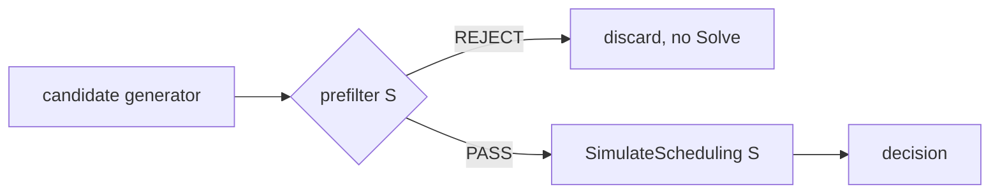

# Consolidation Prefilter: A Sound Cheap Gate Before SimulateScheduling

<!-- Reject provably-doomed candidate node sets before paying for a full
     scheduling simulation, at zero correctness risk. -->

## Motivation

Karpenter's multi-node consolidation proposes a set of nodes to remove and asks the scheduler whether the displaced pods can be re-homed more cheaply. That question is answered by `SimulateScheduling` (a full scheduler `Solve`) — the **expensive** step: it does topology tracking, instance-type filtering, and deep copies, and it grows **super-linearly with cluster size** ([kubernetes-sigs/karpenter#2972](https://github.com/kubernetes-sigs/karpenter/issues/2972)). Today's binary search already pays one `Solve` per evaluated set; a richer candidate generator pays far more.

Many of those `Solve`s are spent on candidate sets that **cannot possibly consolidate** — Karpenter runs the full simulation only to discover it. Even in simple cases:

- removing several near-full nodes whose pods plainly don't fit the few that remain (capacity),
- a replacement whose only feasible instance type costs more than the nodes removed (cost),
- a removal that would violate a topology-spread constraint (skew).

This RFC proposes a **prefilter**: a sound, cheap gate that runs *before* `SimulateScheduling` and rejects candidate sets it can *prove* are doomed, so the scheduler is invoked only on sets that might actually consolidate. The prefilter is **orthogonal to the candidate generator** — it makes no assumption about how sets are proposed — so optimizing the generator later is independent work.

### Use Cases

1. **Infeasible candidate sets today.** Binary search evaluates prefixes that remove too many nodes at once, and every infeasible one costs a full `Solve` — whether it fails on capacity, cost, or topology spread.
   - *For example*, on the reproduced [#2434](https://github.com/kubernetes-sigs/karpenter/issues/2434) shape, the capacity check alone proves **25%** of enumerated sets doomed (measured against the real scheduler — see [Validation](#validation)).
2. **Large / tight clusters ([#2972](https://github.com/kubernetes-sigs/karpenter/issues/2972)).** As clusters grow, `SimulateScheduling` cost rises super-linearly while the prefilter stays near-linear, so the savings grow with scale. On a tight 40-node population, **57%** of sampled sets are doomed and discardable in microseconds each.

### Non-Goals

- **Computing the plan.** The prefilter never decides *what* to consolidate or *how much* it saves. `SimulateScheduling` remains the sole authority on feasibility and cost.
- **Being complete.** The prefilter need not reject every doomed set — only never a *good* one. A missed rejection costs a wasted `Solve`, not correctness. So doom types it does not model (anti-affinity reachability/cardinality, non-homogeneous or multi-TSC topology groups) simply fall through to the scheduler (see [Out of Scope](#out-of-scope-fall-through-to-the-scheduler)).
- **Replacing the generator.** It filters proposals; it does not produce them.

## Proposal

### The Contract

```
prefilter(S) -> REJECT | PASS
```

- `REJECT` ⟹ **provably** no worthwhile consolidation exists for removing `S` → skip the `Solve`.
- `PASS` ⟹ maybe worthwhile → fall through to `SimulateScheduling`, which decides.



**Soundness — fail-closed.** The prefilter must **never `REJECT` a set the scheduler could consolidate** (zero false negatives). Each check is a strict relaxation of the real re-homing problem, so a reject is provably doomed; anything uncertain, unmodeled, or ambiguous resolves to `PASS`. It follows that the prefilter can be enabled without changing *which* consolidations Karpenter performs — only how quickly it skips the doomed ones.

### The Three Checks

Notation, per candidate set `S`:

| symbol | meaning |
|---|---|
| `P` | displaced pods (on the removed nodes) |
| `T` | remaining (target) nodes |
| `d ∈ {cpu, mem, …}` | resource dimensions |
| `demand_d` | Σ requests of displaced pods in dimension `d` |
| `headroom_d` | Σ `Available()` over remaining nodes in `d` |
| `overflow_d` | `max(0, demand_d − headroom_d)` — leftover a new node must absorb |
| `price(S)` | Σ prices of the removed nodes |

#### 1. Capacity — DELETE feasibility · O(P+T)

A DELETE adds no new node, so every displaced pod must fit onto a node that remains. If, in any single dimension, the displaced pods' total request exceeds the remaining nodes' total free capacity — `demand_d > headroom_d` — they cannot all fit, and the DELETE is infeasible → `REJECT`. This is one sum per dimension; no packing, no graph.

**Soundness.** `demand_d > headroom_d` is a necessary condition for infeasibility — a splittable, per-dimension relaxation of the real integral, multi-dimensional packing. If even the relaxed problem has no room, the real one certainly does not.

**Validated.** 0 false negatives across 2,745 sets, and **provably equivalent to a max-flow** for pure capacity (see [Alternatives Considered](#alternative-max-flow-prefilter)).

#### 2. Cost — REPLACE worthwhileness · O(#instance types)

A REPLACE re-homes the displaced pods onto the remaining nodes **plus one** new node (Karpenter allows at most one replacement — the *m→1* rule). Only the `overflow` must go to that new node. `REJECT the replace` if **no instance type — priced from the offerings the candidate's own nodepool permits — is cheaper than `price(S)` while having allocatable ≥ `overflow_d` for every `d`**: no cheaper node can even hold the leftover, so no replace can both fit and save money. This mirrors Karpenter's own `RemoveInstanceTypeOptionsByPriceAndMinValues`.

**Why this is a separate check — the replacement sinkhole.** A capacity check with a *generous* replacement is a sinkhole on the replace path: a big new node absorbs almost any small replace, so a feasibility check prunes nothing there. Only *cost* distinguishes a worthwhile replace from a no-op.

**Soundness.** By conservation, in any replace the remaining nodes hold ≤ `headroom_d`, so the single new node must hold ≥ `demand_d − headroom_d = overflow_d` in every dimension — a viable replacement's capacity ≥ `overflow_d` is *necessary*. If no permitted type both meets that and is cheaper than `price(S)`, the oracle can only no-op. The check is generous in every uncertain direction (largest capacity for "does it fit", cheapest permitted offering for "is it cheaper", ignoring the pods' own scheduling constraints), so it only ever errs toward `PASS`. The price basis **must** come from the candidate's real nodepool (e.g. spot, if the pool allows it) — pricing against a narrower set could wrongly reject a cheaper replace.

**Validated.** 0 false negatives across 1,764 sets; **+23–61% marginal prune over the capacity check** in the cost-dominated regime the capacity sinkhole is blind to.

#### 3. Skew — TSC feasibility · O(Z·m)

For a cleanly-identified **homogeneous** group `D` (identical request `r`) governed by a single zonal `DoNotSchedule` TopologySpread constraint (`maxSkew=k`) over domains (zones) `z`:

```
existing_z = D-pods that STAY in zone z (on nodes not in S)          # fixed
cap_z      = additional D-pods zone z's remaining nodes can hold      # Σ floor(avail/r)
final_z    = existing_z + placed_z,  0 ≤ placed_z ≤ cap_z,  Σ placed_z = P_D
feasible ⇔ ∃ assignment with max_z final_z − min_z final_z ≤ k
```

`maxSkew` is encoded by **enumerating the target minimum level `m`**: feasible-for-`m` ⇔ every zone's `placed_z` fits `[L_z(m), U_z(m)]` and `ΣL_z(m) ≤ P_D ≤ ΣU_z(m)`, where `L_z(m) = max(0, m − existing_z)` and `U_z(m) = min(cap_z, m+k − existing_z)`. With no zone-pinning this is a pure O(Z·m) count check (a max-flow is needed only when volume topology pins pods to zones). The **m→1 replacement** adds capacity in one zone: enumerate `z*` (plus the no-replacement/delete case) and boost `cap_{z*}`. `REJECT S` iff **no `(z*, m)` is feasible**. A skew-doomed group dooms the whole set.

**Domains are the LIVE zones only** — a zone with no remaining node is not a spread domain and must not be modeled as a 0-count domain (doing so inflates skew and is unsound); the replacement's zone is added as a domain when it lands in an empty zone.

**Eligibility is fail-closed.** A group qualifies only if it is a single zonal `DoNotSchedule` TSC with exact request homogeneity and no other coupling. Any ambiguity — multiple TSCs, TSC + (anti)affinity, `ScheduleAnyway`, non-zone `topologyKey`, heterogeneous requests, mixed owners, volume pinning — excludes the group, which falls through to the scheduler. Groups are keyed by **owner-reference UID / workload label**, *not* by reusing Karpenter's `TopologyGroup`s (see [Alternatives Considered](#alternative-topologygroup-reuse)).

**Soundness.** `cap_z` is exact-or-over (identical items ⇒ Σ per-node floors is exact; ignoring within-zone anti-affinity only over-counts); the `m`-equivalence for `max−min ≤ k` is exact; the replacement is modeled as the largest instance in whichever single zone helps most (most permissive); unmodeled constraints (`minDomains`, competition for the same room, soft terms) only make reality stricter or the model more permissive. So a set infeasible for all `(z*, m)` is truly infeasible.

**Validated.** 0 false negatives across 590 sets; **77% prune where the capacity check gets 0%** — the aggregate check is *blind to skew*, so this prune is entirely marginal.

### Combine Rule

```
REJECT S  iff  ( capacity-infeasible(S)  AND  cost-unworthwhile(S) )
               OR  ( any eligible skew group in S is skew-infeasible )
```

A DELETE and a REPLACE are the only two ways `S` can consolidate on capacity/cost grounds, so `S` is capacity/cost-doomed only if *both* fail. Topology is orthogonal: a skew violation dooms `S` regardless. Checks 1 and 2 compose into a single pass over the overflow (check 2 subsumes check 1: if the overflow exceeds even the largest node, no replacement fits — which is exactly check 1). All three are strict relaxations, so their disjunction is still sound.

### How It Works

The prefilter runs entirely on in-memory cluster state and instance-type metadata; it makes no API calls and launches no simulation.

1. **Gather** (O(P+T)): from `StateNode`s, collect the displaced pods on `S`, the remaining nodes with their `Available()` headroom per dimension and their zone, and `price(S)`.
2. **Capacity + cost**: compute `overflow_d`. If `overflow == 0`, a DELETE is capacity-feasible → do not reject on capacity/cost. If `overflow > 0`, scan instance types for a permitted offering cheaper than `price(S)` that covers the overflow; if none, this branch rejects.
3. **Skew**: identify eligible groups among the displaced pods (fail-closed) and run the O(Z·m) count check for each. Any infeasible group rejects.
4. Return `REJECT` if the combine rule fires; else `PASS`.

### Observability

- `karpenter_consolidation_prefilter_total{decision}` — `reject` vs `pass`; the prune rate.
- `karpenter_consolidation_prefilter_reject_reason{reason}` — `capacity_cost` vs `skew`; attributes the prune.
- **Missed-prune signal** — count `PASS`ed sets that `SimulateScheduling` then returns as **no-op**. This bounds the prune left on the table: a high count means either doom types the prefilter does not yet model (candidates for a new check) or plain cost no-ops. It also pairs with the dry-run mode below to verify the hard invariant — a rejected set that the scheduler *would* have consolidated is a false negative and must never occur.

## Validation

All three checks were validated in a research harness (test code that drives the **real** `SimulateScheduling` as a ground-truth oracle on an in-memory fake client — **not** the shipping implementation). For each scenario the harness enumerates removal sets, runs both the cheap check and the real oracle, and asserts the hard invariant **`false negatives == 0`** (the test fails if any check rejects a set the oracle consolidates).

**Capacity (aggregate check) vs oracle** — 0 FN / 2,745 sets, marginal-over-flow = 0 everywhere:

| scenario | sets | agg prune% | FN |
|---|---|---|---|
| mix-* (underutilized) | 238 ea | 0.0 | 0 |
| tight-homogeneous | 238 | 11.8 | 0 |
| issue-2434 | 837 | 25.1 | 0 |
| scale-40-tight | 280 | 57.1 | 0 |

**Cost / price prune vs oracle** — 0 FN / 1,764 sets:

| scenario | sets | price prune% | capacity-only% | marginal | FN |
|---|---|---|---|---|---|
| medium-full-6 | 57 | 73.7 | 12.3 | +61.4% | 0 |
| medium-full-8 / tight | 238 | 35.3 | 11.8 | +23.5% | 0 |
| large-underutil / half | 57 ea | 0.0 | 0.0 | 0 | 0 |
| issue-2434 | 837 | 26.9 | 25.1 | +1.8% | 0 |
| scale-40-full | 280 | 57.1 | 57.1 | 0 | 0 |

**Skew / TSC count check vs oracle** — 0 FN / 590 sets, capacity check 0% everywhere (skew-blind):

| scenario | sets | skew prune% | capacity% | marginal | FN |
|---|---|---|---|---|---|
| zonal-skew-tight | 57 | 77.2 | 0.0 | +77.2% | 0 |
| zonal-skew-loose | 57 | 0.0 | 0.0 | 0 | 0 |
| mix-zonalTSC / mix-mixed | 238 ea | 0.0 | 0.0 | 0 | 0 |

**Combined `prefilter(S)` (end-to-end) vs oracle** — the three checks behind one gate, run over an over-generating proposer (all-subsets enumeration = worst-case stress, not yet the real generator) across an 8-scenario sweep — **0 FN / 2,002 sets**:

| metric | value |
|---|---|
| oracle calls **saved** (sweep) | **29.8%** (up to 77% in doomed regimes) |
| recall on oracle no-ops | 49.5% |
| per-check attribution | capacity 426 · +cost 127 · +skew 44 |
| over-rejection on benign clusters | 0% |
| false negatives | 0 / 2,002 |

The three checks are **complementary**: capacity catches gross over-removal, price catches cost no-ops (where the capacity check is a sinkhole), skew catches topology doom (where the capacity check is blind). None dominates, and the gate never eliminates a re-homeable set.

## Alternatives Considered

**Max-flow prefilter.** Model re-homing as a per-dimension transportation max-flow and reject when flow cannot saturate demand. Sound and fully prototyped, but **redundant with the O(P+T) aggregate sum for pure capacity**: with no reachability restriction, max-flow-feasible ⟺ `Σdemand ≤ Σcapacity` exactly, and its marginal prune over the sum was **0** across 2,745 sets — at higher cost. It retains one genuine but unmeasured-in-prevalence niche (resource-reachability Hall violations, capacity stranded behind anti-affine peers), deferred until production data shows it is common. It is blind to *cardinality* Hall violations entirely.

**TopologyGroup reuse** for check 3. Rejected: Karpenter's `TopologyGroup`s are transient, unexported, per-`Solve` artifacts keyed on *pod* UIDs (not workload UIDs) and not cheap to rebuild at disruption time. The design instead groups by **owner-reference UID / workload label** plus exact request-signature homogeneity — cheap, stable, and on every pod.

**Anti-affinity cardinality check.** Cheap and sound, but **deferred, not built on spec**: Kubernetes discourages pod anti-affinity above ~several hundred nodes (the scale this targets) and positions TSC as the sanctioned spread mechanism, so expected value is low. Gate it behind a production measurement of wasted `Solve`s on anti-affinity-doomed sets.

## Backward Compatibility

The prefilter is an internal optimization with no user-facing API surface (no CRD, annotation, or flag). By the soundness contract it cannot alter which consolidations Karpenter performs — only avoid simulating doomed sets — so existing NodePool specs and behavior are unchanged, with no migration.

## Graduation Criteria

- **Alpha — gated, off by default, with a dry-run option.** In dry-run the prefilter computes its verdict but does **not** skip the `Solve`; it records what it *would* have rejected and whether the scheduler agreed (must be a no-op). This confirms zero false negatives on real clusters and measures prune before any behavior changes.
- **Beta — gated, on by default (dry-run still available).** The prefilter skips doomed `Solve`s; prune-rate, reject-reason, and missed-prune metrics validate the win and continued zero false negatives across representative workloads.
- **GA — gate removed.** Sustained zero-false-negative evidence in production; the prefilter is unconditional. The deferred checks (anti-affinity cardinality, max-flow reachability) are revisited only if metrics show meaningful wasted `Solve`s on those doom types.

## Open Questions

1. **Reschedule-neighborhood bounding.** To keep the per-set gather at O(P+T) independent of total cluster size, targets should be bounded to a reschedule neighborhood rather than every node. What is the right neighborhood definition, and does bounding it ever risk unsoundness (under-counting headroom)?
2. **Prevalence of the deferred doom types.** How common are resource-reachability Hall violations and anti-affinity cardinality doom in real clusters? The missed-prune metric decides whether the deferred checks are ever worth building.
3. **End-to-end payoff with a real generator.** The three checks are already wired behind one `prefilter(S)` and measured over an over-generating enumeration proposer (0 FN / 2,002 sets, 29.8% of `Solve`s saved). The remaining step is to couple the gate to a real many-candidate generator and measure total `Solve` calls saved per consolidation cycle at scale.
4. **How much homogeneity holds in practice?** The skew check requires exact request-signature homogeneity, which VPA, in-place vertical scaling, and injected sidecars break. What fraction of TSC-governed workloads are cleanly eligible, and therefore how much skew prune is realizable?

## Out of Scope (fall through to the scheduler)

- The full plan cost and exact integral packing — the scheduler computes these.
- Anti-affinity reachability / cardinality — minor at scale, deferred behind production measurement; **do not** build a max-flow or cardinality check on spec.
- Non-homogeneous or multi-TSC topology groups — check 3 fails closed and falls through.
